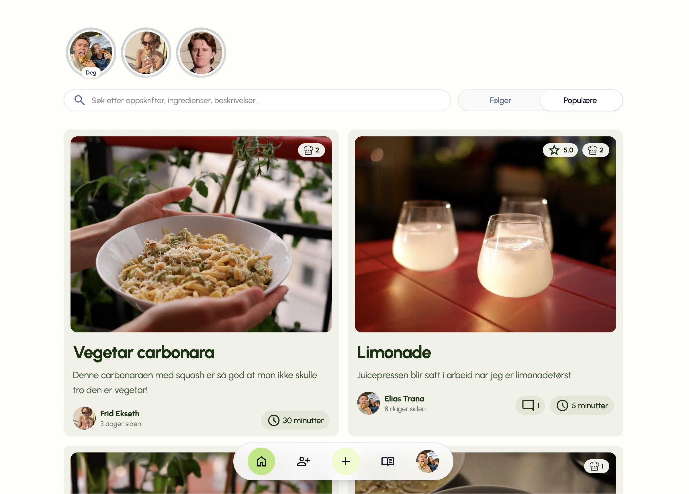

# Svelta




Svelta er en sosial oppskrifts-app der du kan lage, dele og oppdage matoppskrifter. Du kan følge venner, samle oppskrifter i egne samlinger, like og vurdere andres oppskrifter.

Appen er bygget med [Next.js](https://nextjs.org) (App Router) og bruker [Firebase](https://firebase.google.com) til autentisering, database (Firestore), fillagring og bakgrunnsjobber (Cloud Functions). AI-funksjonene drives av [OpenAI](https://openai.com).

## Funksjoner

- **Lag og rediger oppskrifter** med ingredienser, fremgangsmåte, koketid, temperatur, porsjoner og bilder.
- **Importer oppskrift fra URL** – appen henter siden, og AI strukturerer den automatisk til tittel, ingredienser og steg.
- **AI-genererte tagger** basert på tittel, beskrivelse, ingredienser og fremgangsmåte.
- **AI-anbefalinger** – skriv hva du er sugen på, og få forslag til en passende oppskrift fra biblioteket.
- **Sosialt** – følg venner, send og godta venneforespørsler, lik, kommenter og vurder oppskrifter.
- **Samlinger** – organiser oppskrifter i egne samlinger (med dra-og-slipp).
- **Synlighet** – velg om en oppskrift skal være offentlig eller privat.
- **Populæritet** – oppskrifter rangeres med en populæritetsscore som beregnes automatisk i bakgrunnen.
- **Offentlige oppskriftssider** – enkeltoppskrifter kan deles med fin forhåndsvisning, også for utloggede brukere.

## Teknologi

- **Next.js 15** (App Router) og **React 19**
- **TypeScript**
- **Tailwind CSS 4**
- **Firebase**: Authentication (e-post/passord + Google), Firestore, Storage og Cloud Functions
- **OpenAI** for import, tagger og anbefalinger
- **TanStack React Query** for datahenting og caching
- **Framer Motion** for animasjoner og **dnd-kit** for dra-og-slipp
- **Cheerio** for å parse nettsider ved import av oppskrifter

## Prosjektstruktur

```
app/              Next.js App Router – sider og API-ruter
  api/            Server-ruter (auth-sesjon, import-recipe, generate-tags, recommend)
  recipe/         Oppskriftssider (visning og redigering)
  collections/    Samlinger
  user/[id]/      Brukerprofiler
helpers/          Hjelpefunksjoner for henting/skriving av data
hooks/            React Query-hooks (oppskrifter, brukere, samlinger osv.)
lib/              Firebase Admin (server-side)
functions/        Firebase Cloud Functions (populæritetsscore, planlagte jobber)
scripts/          Engangs-/vedlikeholdsskript
firebase.ts       Firebase-klientoppsett
middleware.ts     Rutebeskyttelse (offentlige vs. innloggede ruter)
```

## Kom i gang

Krever Node.js (se `package.json` for versjoner av avhengigheter).

1. Installer avhengigheter:

    ```bash
    npm install
    ```

2. Opprett en `.env.local`-fil i rotmappen med følgende variabler:

    ```bash
    # Firebase-klient (offentlig – sendes til nettleseren)
    NEXT_PUBLIC_FIREBASE_API_KEY=
    NEXT_PUBLIC_FIREBASE_AUTH_DOMAIN=
    NEXT_PUBLIC_FIREBASE_PROJECT_ID=
    NEXT_PUBLIC_FIREBASE_STORAGE_BUCKET=
    NEXT_PUBLIC_FIREBASE_MESSAGING_SENDER_ID=
    NEXT_PUBLIC_FIREBASE_APP_ID=

    # Server-side hemmeligheter (skal ALDRI deles offentlig)
    FIREBASE_SERVICE_ACCOUNT_KEY=   # hele service account-JSON-en som én streng
    OPENAI_API_KEY=
    BACKFILL_KEY=                   # nøkkel for vedlikeholds-/backfill-endepunkter
    ```

    > `.env.local` er allerede i `.gitignore` og skal aldri sjekkes inn.

3. Start utviklingsserveren:

    ```bash
    npm run dev
    ```

    Åpne [http://localhost:3000](http://localhost:3000) i nettleseren.

## Nyttige kommandoer

```bash
npm run dev                      # Start utviklingsserver
npm run build                    # Bygg for produksjon
npm run start                    # Kjør produksjonsbygg
npm run lint                     # Kjør ESLint
npm run format                   # Formater koden med Prettier

npm run backfill:public-users    # Vedlikehold: fyll ut offentlige brukerprofiler
npm run fix:recipe-timestamps    # Vedlikehold: rett opp tidsstempler på oppskrifter
```

## Firebase Cloud Functions

Mappen `functions/` inneholder bakgrunnslogikk som kjører i Firebase:

- **Populæritetsscore** beregnes automatisk når en oppskrift endres (likes og kommentarer vektet mot alder).
- **Planlagte jobber** (scheduler) for jevnlig vedlikehold.
- **HTTP-endepunkter** for backfill, beskyttet med `BACKFILL_KEY`.

## Sikkerhet og personvern

- Hemmeligheter ligger kun i `.env.local` og er ikke en del av repoet.
- `NEXT_PUBLIC_*`-variablene er Firebase-klientkonfigurasjon og er ment å være offentlige – tilgangskontroll håndteres av **Firestore- og Storage-sikkerhetsregler** i Firebase, ikke av at verdiene er skjult.
- `middleware.ts` styrer hvilke ruter som er offentlige (forside, innlogging, enkeltoppskrifter) og hvilke som krever innlogging.

## Distribusjon

Appen er laget for å distribueres på [Vercel](https://vercel.com), med Cloud Functions og database i Firebase. Husk å sette alle miljøvariablene i Vercel-prosjektet.
